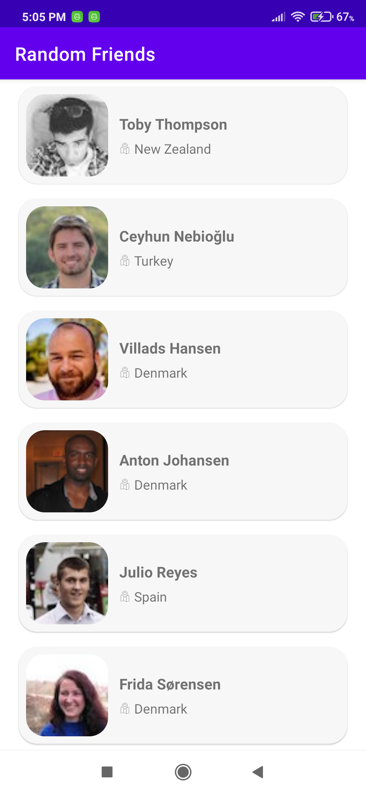
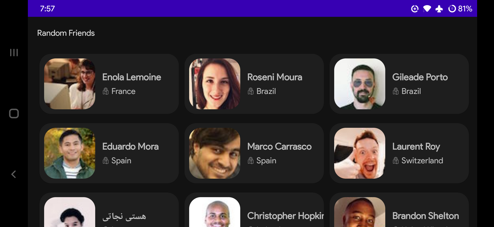
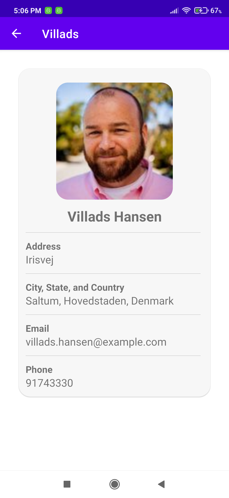
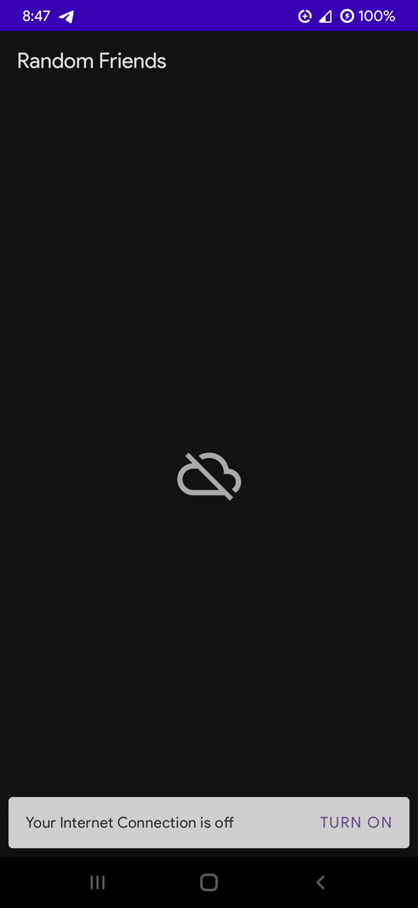

# Friends App Task

**Friends** is a native Android Application that uses [Random User API](https://randomuser.me/) for its backend.

This app follows MVVM architecture and uses Dagger-Hilt for dependency injection.

# Screenshots

# External Libraries

1. **Retrofit**, for HTTP request
2. **GSON**, for JSON serialisation
3. **Dagger-Hilt**, for dependency Injection
4. **Glide**, for image loading.
