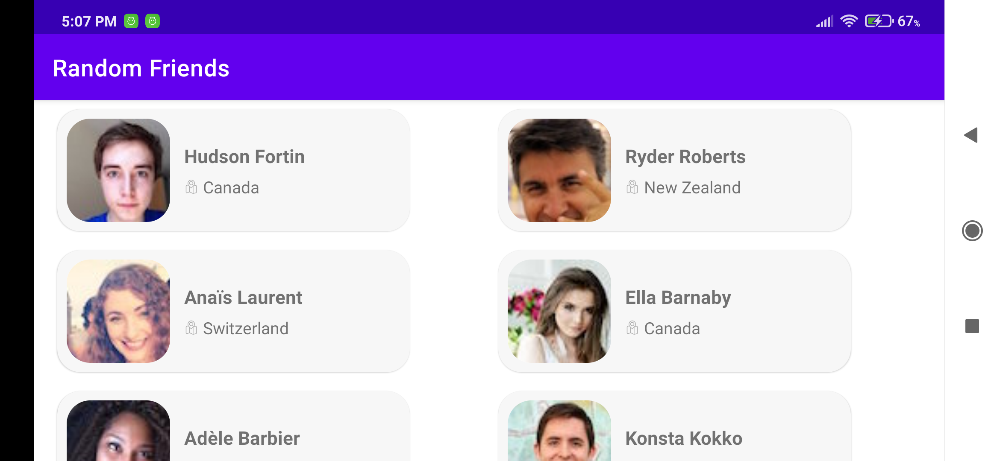

# Freinds App Task
**Friends** is a native Android Application, that I have developed as an assignment task given by the TBL LLC. This app uses [Random User API](https://randomuser.me/) for its backend. 

This app follows MVVM architecture, and makes use of modern android development tools, such as Kotlin, Kotlin Coroutine, and Dagger-Hilt. 

# Screenshots

# External Libraries
1. **Retrofit**, for HTTP request
2. **GSON**, for JSON serialisation
3. **Dagger-Hilt**, for dependency Injection
4. **Glide**, for image loading.
